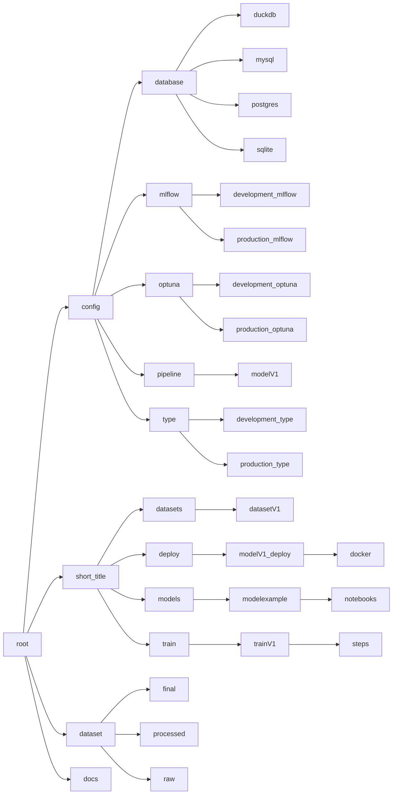

# Artificial Inteligence Project Template

This is a [cookiecutter](https://www.cookiecutter.io/) template focused
on AI, designed for model architecture development, dataset creation,
pipeline development, and model deployment using several open and free
state-of-the-art tools.

------------------------------------------------------------------------

This project was developed with multi-model and multi-dataset studies
and implementations in mind. It is designed to use [*mlflow*](https://mlflow.org/), [*dvc*](https://dvc.org/), [*pre-commit*](https://pre-commit.com/), [*git*](https://git-scm.com/), [*docker*](https://www.docker.com/) or [*podman*](https://podman.io/), [*jupyter lab*](https://jupyter.org/), [*hydra*](https://hydra.cc/), [*bentoml*](https://www.bentoml.com/), [pipenv](https://pipenv-es.readthedocs.io), and, at your choice, variousdatabases like *duckdb* or *PostgreSQL* in local or cloud environments.

The project manages its own environment variables through a *.env* file
integrated with *Hydra* configurations, offering two development
branches (*development* and *production*) at the *Hydra* level. The
project also uses [*pdoc*](https://pdoc.dev/) to generate useful
documentation in *HTML* format.

## Folder structure of project



## Requeriments (Linux - debian like OS)

This project takes care of configuring all its dependencies and tools.
However, it requires that you have the Python package manager (*pip*)
and *cookiecutter* installed.

```shell
sudo apt install python3-pip git && \
pip install --upgrade pip && \
pip install --upgrade cookiecutter
```

## Instantiate a projet

To instantiate a project, you can do it just typing

```shell
cookiecutter https://github.com/kascesar/artificial-inteligence-template.git
```

then follow the instruction.git

---

## For developers - Configure git hooks for this project

after *cloning*

```shell
chmod +x setup_hooks.sh && \
sh setup_hooks.sh
```

1. 
