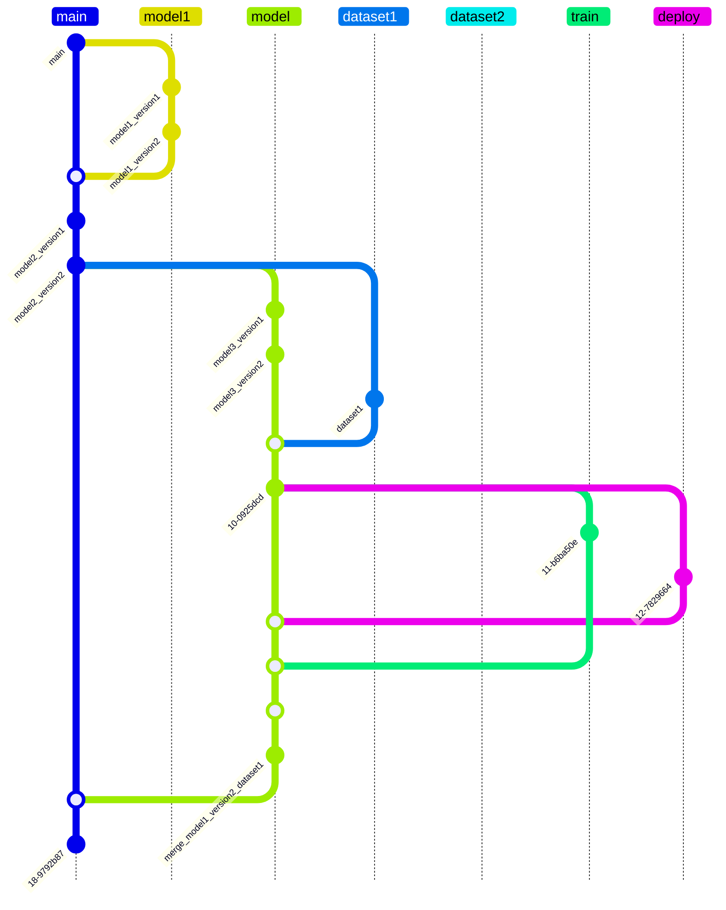
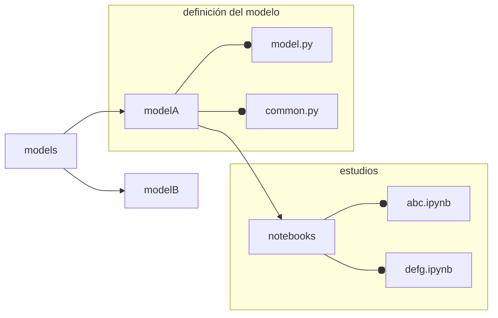
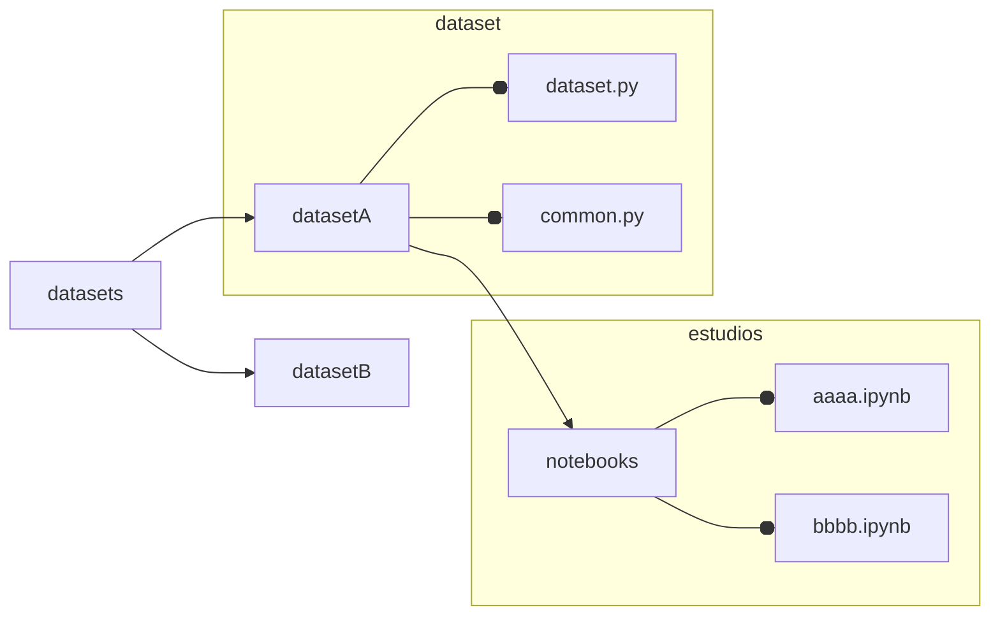
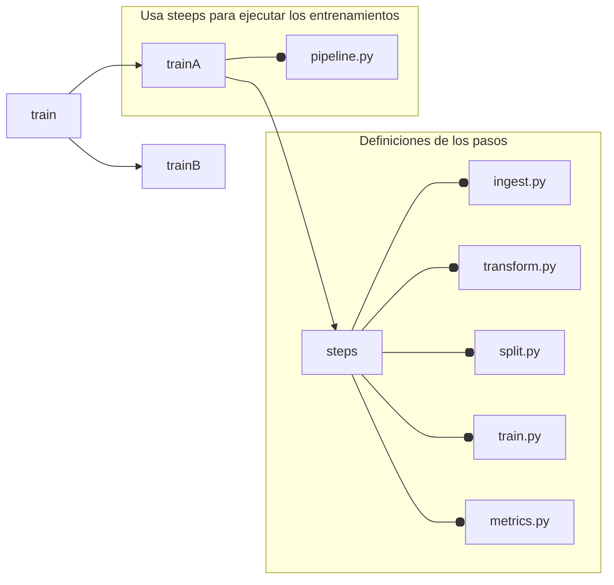
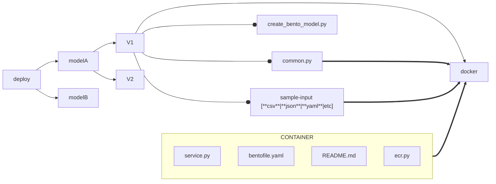

# {{ cookiecutter.long_title }} - {{ cookiecutter.short_title }}

---

* *abstract*: {{ cookiecutter.description }}

---

# Development *Laws*

The following practices must be followed if you intend to collaborate with continuous development.

1. This project uses *Pipenv* to track dependencies
2. Hydra.cc is used to manage project configurations.
   a. Any new model must strictly use configurations with Hydra
   b. The collaborator must preserve the configuration scheme and development guidelines explained below
3. Models **must** be logged in *mlflow* following the same model branch scheme explained below
   a. If the *pull request* is for a model and it's not logged in *mlflow*, it will be rejected
   b. If the *pull request* is rejected but there's still a log in *mlflow*, the *mlflow* model **must be deleted**
4. *Deployments* are done through **BentoML**.
5. Only the development director can establish the versions of dependencies
   a. Any *pull request* that sends modifications to the Pipfile and/or Pipfile.lock will be discarded
   b. Any *pull request* that doesn't adequately explain the changes sent will be discarded
6. This project uses pre-commit, which must be passed and will help you avoid having your changes discarded.
7. Make sure all functions and classes are correctly written, this project uses *pdoc* to create documentation which supports markdown, latex, and mermaid.
8. It's a requirement of this project to create class and flow diagrams (as necessary) with ***Mermaid***, these should be placed in the documentation.

---

# Development Guidelines

Two development branches have been defined as a base -**not at the git level**, but at the hydra level-

* development
* production

These are considered super-branches, that is, they are superior configurations that govern
the lower configurations.

*Lower* branches are defined as those related to *pipelines*.
A *Pipeline* is that batch of configurations to do:

* statistical analysis
* model training
* model comprehension
* other studies ...

**Pipelines** should have a task name followed by the pipeline name following the following scheme:


```
<task>_<name>
```

task:

* train   -> reserved
* dataset -> reserved
* study   -> reserved
* etc

another allowed scheme:

```
<model&version>-<dataset&version>
```

Which is useful to over-understand that this corresponds to a model training with a particular dataset

---

## Collaborators' Freedoms

Collaborators have the freedom to write tests, code, and sketches in the subnodes called *notebooks*
which are nested in the folders *datasets/<dataset_name>/notebooks* and *models/<model_name>/notebooks*.
In them, collaborators have the freedom to write the code they want, keeping the good practices
established by **PEP8**. The dependency rule still exists at this point, which continues to limit
the collaborator to request the integration of new dependencies from the project director.

---

## GIT Branch Schemes

The main branch **main** is the branch where the latest versions of all models, datasets, trainings, and deployments converge.
The other **branches** are exclusive for the development of each particular *piece*.
The **branches** of the **branches** are for the versions of each *piece*.

Dataset versions are tracked by *DVC* in the main branch
All raw data files whether CSV, images, and others should not be tracked with git for any reason
except for specific cases determined by the project director.

In summary:



---

## Development of Models

In the models sub-module should go all the developments of artificial intelligence models, each model should be contained in its own folder with the camelcase format for those cases where it is necessary.

Then the folder structure of the models would be as follows:



Development of Datasets

The code that generates the datasets should also be put in its own module, following the following scheme:


Note that *common.py* and *dataset.py* are strict and although *common.py* is empty it must exist.

- *common.py* is the right place to put helper functions for the *dataset.py* module.
- *dataset.py* is the place where the functions/classes that create the dataset should be declared.


## Desarrollo de *Entrenamientos*
The training of the various models should be structured in the *train* folder intended for this process, this
is because each model does not necessarily use a specific type of dataset, which naturally means we can have 
different types of datasets for the same model.
The structure to follow is as follows:


The definition of the modules contained in *steps* is not strict and may vary as appropriate.
The definition of *pipeline.py* in the *root* of the particular model with a *function* called *train* is strict.

```python
def train(config:DictConfig):
    """
    ...docstring...
    """
    #codigo
    return model
```
The argument should always be a config of type DictConfig that will always come from *Hydra*.

---

## Development of *Deploy*

This module is not intended to be executed through *pipelines*, because it lacks necessity,
it is not a highly demanding or highly iterative task. The folder and module structure for
this sub-module is as follows. Avoid using `__init__.py` files in this way *pdoc* would not
document these *deployment* modules.



As the trainings are logged in *mlflow*, containerizing models is very simple with the help
of *BentoML*. Each type of model can have *versions*, these versions correspond to *modules*
and each module has a folder intended for *deployment* (docker). Reference is made to an **ecr.sh file**
which contains the code to log the model in the corresponding repository previously created in *ecr* in a
direct, fast and simple way, it is recommended to use it in other *deploy* developments.

```shell
#!/bin/bash

REGION="us-east-1"
AWS_ACCOUNT_ID=$(aws sts get-caller-identity --query Account --output text)
ECR_NAME="champion"
DOCKER_NAME='champion'
ECR_TAG="champion"
BACKEND="podman"

bentoml build

OUTPUT=$(bentoml containerize ${DOCKER_NAME}:latest --backend ${BACKEND})

ACTUAL_TAG=$(echo "$OUTPUT" | grep -oP 'detector-lstm-v1-bhp:\K[^ ]+')
ACTUAL_TAG=$(echo "$ACTUAL_TAG" | tr -d '"')

aws ecr get-login-password --region ${REGION} | ${BACKEND} login --username AWS \
    --password-stdin ${AWS_ACCOUNT_ID}.dkr.ecr.${REGION}.amazonaws.com

if ! ${BACKEND} images | grep -q "${DOCKER_NAME}:${ACTUAL_TAG}"; then
  echo "Error: Docker image ${DOCKER_NAME}:${ACTUAL_TAG} does not exist."
  exit 1
fi

${BACKEND} tag ${DOCKER_NAME}:${ACTUAL_TAG} ${AWS_ACCOUNT_ID}.dkr.ecr.${REGION}.amazonaws.com/${ECR_NAME}:${ECR_TAG}

${BACKEND} push ${AWS_ACCOUNT_ID}.dkr.ecr.${REGION}.amazonaws.com/${ECR_NAME}:${ECR_TAG}

if [ $? -eq 0 ]; then
  echo "Successfully pushed ${AWS_ACCOUNT_ID}.dkr.ecr.${REGION}.amazonaws.com/${ECR_NAME}:${ECR_TAG}"
else
  echo "Failed to push image to ECR."
  exit 1
fi
```

On the other hand, the `create_bento_model.py` file should look something like this:


```python
import bentoml
import mlflow
import pandas as pd
from common import XBuilderAnomaly, anomaly_mesure

bentoml.mlflow.import_model(
    "champion-detector",
    model_uri="<MLflow-model-uri>",
    signatures={"predict": {"batchable": False, "batch_dim": 0}},
    custom_objects={
        "x_builder": XBuilderAnomaly(),
        "champion_mesure": anomaly_mesure,
        "sample_input": pd.read_csv(
            "docker/sample-input.csv",
        ),
    },
)
```

Also, an example of how the *service.py* necessary for BentoML to automatically create the model's *API* should look is provided:


```python
import os
from io import StringIO

import bentoml
import pandas as pd
from bentoml.io import JSON, Text

model_ref = bentoml.mlflow.get("champion-detector:latest")

runner = model_ref.to_runner()

xbuilder = model_ref.custom_objects["x_builder"]
mesure = model_ref.custom_objects["champion_mesure"]
sample_input = model_ref.custom_objects["sample_input"]

svc = bentoml.Service(
    name="champion-detector",
    runners=[runner],
)


@svc.api(input=Text.from_sample(sample_input.to_csv(index=False)), output=JSON())
async def predict(data):
    data = pd.read_csv(StringIO(data), engine="pyarrow")
    X, dts = xbuilder(data)
    result = await runner.async_run(X)
    return {"champion-score": [f"{i}" for i in mesure(X, result)], "timestamp": dts}
```

## Standard class and function flow diagram

In the project we will use the following *standard* to define flow diagrams:

1. reference and name of the class
2. variables and inputs of the constructor `__init__`
3. definition of methods, their variables and their output

An example:

    ```
    classDiagram
    class DS["DataSetV1"]{
        client ~str~            <- var1
        path ~str~              <- var2
        config ~DictConfig~     <- var3
    
        -__init__(              <- metodo 1
            client~str~,        <- var1
            path~str~,          <- var2
            confi~DictConfig~   <- var3
            ) None              <- retorno
        +creatDS() ~bool~       <- metodo2 retorno
    }
    DS <| -- DictConfig         <- DictConfig es una clase dentro de una clase
    ```

The symbols `+, -, # and ~` are reserved for *public method*, *private*, *protected* and internal.

**Note**: You must add the modifications to the diagram in each commit for your commit to be accepted.

---

# Table creation nomenclature

`<model-name>_dataset_<version>`

For example:

`lstmconv_dataset_v1`

# Requirements for pull requests

In order to accept pull requests, it is assumed that you understand the above requirements. The reviews will be the following:

## Models

1. Modelo va acompañado de la descripcion y toda la informacion relevante en su
   `__init__`.

1. Model is accompanied by the description and all relevant information in its `__init__`.
2. Simple explanation of the model
3. Motivation
4. Flow diagram written in **Mermaid**
5. Fully documented code (**with its own docstring too**)
6. If the pull request is a change to an existing model, you must add a new field called `#changes` in the `__init__`, indicating the change. If the change is structural, make all necessary modifications in the previous points.


NOTE: **It should have passed the pre-commit**

---

# Initializing the project

```shell
# Dependencies
pip install pipenv
```

```shell
# Inside the project folder
pipenv install # installs the project dependencies and it may take some time

pipenv shell   # initializes the python environment

# Install the git hooks
pre-commit install
```

# Creating the documentation

To create the documentation it is necessary to do:

```shell
# Siempre desde la razi del repositorio
pdoc --mermaid --math frd -o docs/
```
