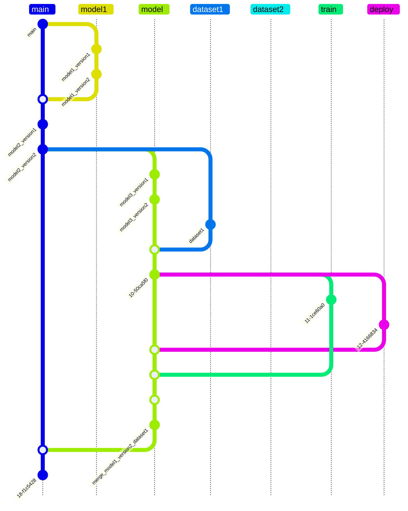
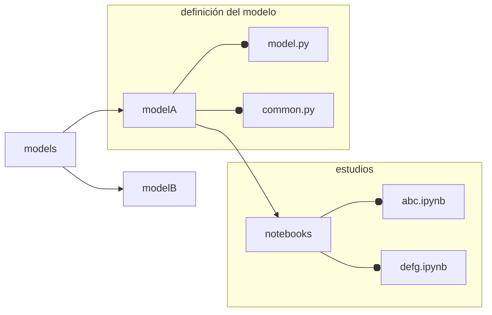
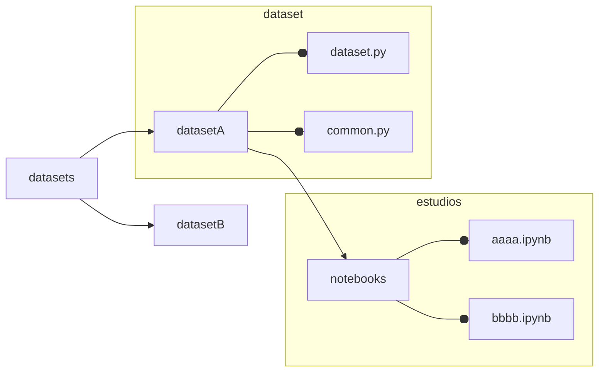
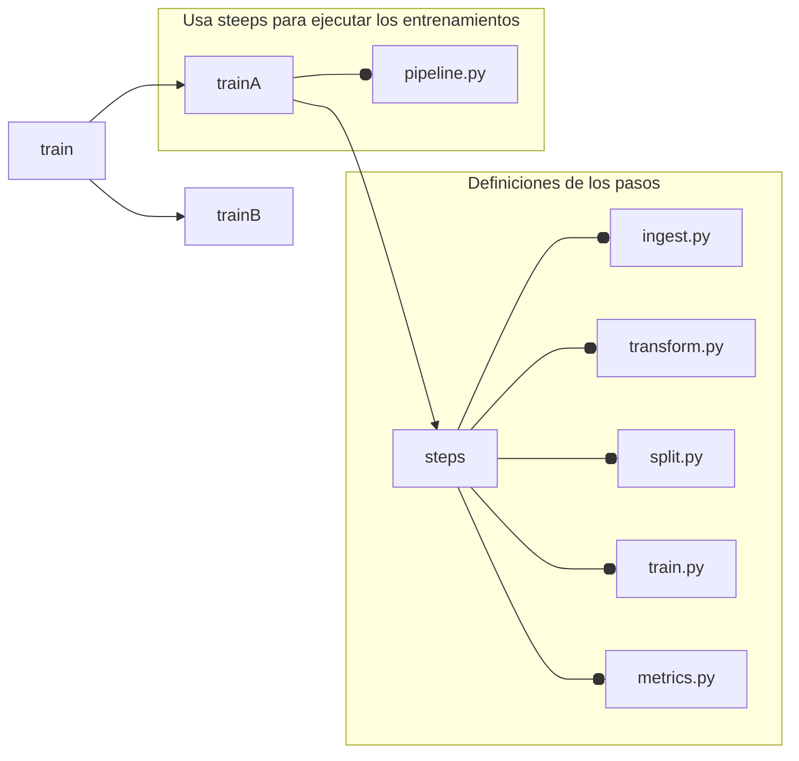
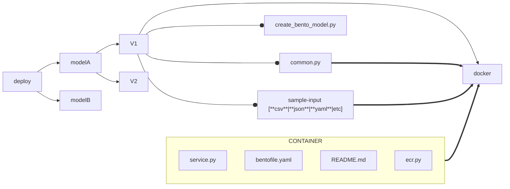

# {{ cookiecutter.long_title }} - {{ cookiecutter.short_title }}

---

* *abstract*: {{ cookiecutter.description }}

---

# *Leyes* de desarrollo

Se exige seguir las siguientes practicas si pretende colaborar con el desarrollo continuo.

1. Este proyecto usa *Pipenv* para hacer seguimiento de las dependencias
2. Se usa Hydra.cc para gestionar las configuraciones del proyecto.
   a. Cualquier nuevo modelo debe usar estrictamente las configuraciones con Hydra
   b. El colaborador debe preservar el esquema de configuraciones y los lineamientos de desarrollo explicados mas abajo
3. Los modelos **deben** ser logeados en *mlflow* siguiendo el mismo esquema de ramas de modelos explicada abajo
   a. Si el *pullrequest* es de un modelo y no está logeado en *mlflow*, será rechazado
   b. si el *pullrequest* es rechazado pero aun así hay un log en *mlflow*, el modelo de *mlflow* **debe ser eliminado.
4. Los *deploys* son mediante **BentoML**.
5. Solo el director de desarrollo puede establecer las versiones de las dependencias
   a. Cualquier *pullrequest* que envíe modificaciones al Pipfile o/y Pipfile.lock se descartá
   b. Cualquier *pullrequest* que no explique adecuadamente los cambios enviados será descartado
6. Este proyecto usa pre-commit, el cual debe ser superado y le ayudará para evitar que se descarten sus cambios.
7. Asegurese de que todas las funciones, clases estén correctamente escritas, este proyecto usa *pdoc* para crear la documentación este soporta markdown, latex y mermaid.
8. Es una exigencia de este proyecto crear los diagramas de clases y flujo (según sea necesario) con ***Mermaid***, estos deben ser puestos en la docuemntación.

---

# Lineamientos de desarrollo

Se definió como base dos ramas de desarollo -**no a nivel de git**, de hydra-

* development
* production

Estas son consideradas super-ramas, es decir, son configuraciones superiores que gobiernan
las configuraciones inferiores.

Se define como ramas *inferiores* a aquellas relacionadas con los *pipelines*.
Un *Pipeline* es aquel lote de configuraciones para hacer:

* analisis estadisticos
* entrenamientos de modelos
* comprension de modelos
* otros estudios ...

Los **piplines** deben tener nombre de tarea seguido del nombre del pipline siguiendo el siguiente esquema:

```
<tarea>_<nombre>
```

tarea:

* train   -> reservado
* dataset -> reservado
* estudy  -> reservado
* etc

otro esquema permitido:

```
<modelo&version>-<dataset&version>
```

El cual es util para sobre-entender que este corresponde a un entrenamiento de un modelo con un dataset particular

---

## Libertades de los colaboradores

Los colaboradores poseen la libertad de escribir pruebas, codigo y esquetches en los subnodos denominados *notebooks*
los cuales se encuentran aninados en las carpetas *datasets/<dataset_name>/notebooks* y *models/<model_name>/notebooks*.
En ellos los colaboradores poseen libertad para escribir el codigo que deseen guardando las buenas practicas
establecidas por **PEP8**. La regla de las dependencias sigue existiendo en este punto, lo que sigue limitando
al colaborador a solicitar al director del proyecto la integracion de nuevas dependencias.

---

## Esquemas de ramas de GIT

La rama principal **main** es la rama donde convergen las ultimas versiones de todos los modelos, datasets, entrenamientos y deployments.
Los otros **branchs** son exclusivos para el desarollo de cada *pieza* particular.
Los **branchs** de los **branchs** son para las versiones de cada *pieza*.

Las versiones de los dataset es llevada por *DVC* en la rama main
Todos los archivos de datos raw ya sea los CSV, imagenes y otros no se les debe hacer seguimiento con git  por ningún motivo
a excepcion de casos especificos determinados por el director del proyecto.

En resumen:



---

## Desarrollo de  *Models*

En el sub-modulo models deben ir todos los desarrollos de los modelos de *inteligencia artificial*, cada modelo debe
contenerse en su propia carpeta con en formato *camellcase* para aquellos casos que sea necesario.

Entonces la estructura de carpeta de los modelos quedaría de la siguiente forma:



## Desarrollo de *Datasets*

El codigo que genera los datasets tambien deben ser puestos en su propio modulo, siguiendo el siguiente esquema:



Tenga en cuenta que *common.py* y *dataset.py* son estrictos y aunque *common.py* se encuentre vacio debe existir.

- *common.py* es el lugar correcto para poner las funciones de ayuda para el modeulo dataset.py.
- *dataset.py* es el lugar donde debe declararse las funciones/clases que creen el dataset.

## Desarrollo de *Entrenamientos*

El entrenamiento de los diversos modelos deben estructurase en la carpeta *train*
destinada a este proceso, esto se debe a que cada modelo, no necesariamente usa
un tipo de dataset especifico, lo que hace naturalmente que podamos tener diferentes tipos de dataset para el mismo modelo.
La estructura a seguir es la siguiente



La de definición de los modulos contenidos en *steps* no son estrictas y pueden variar según corresponda.
Es estricta la definción *pipeline.py* en la *raiz* del modelo particular con una *función* llamada *train*

```python
def train(config:DictConfig):
    """
    ...docstring...
    """
    #codigo
    return model
```

El argumento siembre debe ser un config del tipo DictConfig que provendrá siempre de *Hydra*

## Desarrollo de *Deploy*

Este modulo, no está pensado para ser ejecutado mediante *pipelines*, debido a que carece de necesidad,
no es una tarea altamente demandante ni altamente iterativa. La estructura de carpetas y modulos para
esta sub-modulo es la siguiente. Evite usar archivos `__inint__.py` de esta forma *pdoc* no documentaría
estos modelus de *deployments*



Como los entrenamientos están logeados en *mlflow* contenerizar modelos es muy simple con la ayuda de *BentoML*. Cada tipo de modelo puede tener *versiones*, estas versiones se corresponden con *módulos* y cada modulo tiene una carpeta destinada para el *deployment* (docker). Se hace alusión a un **archivo ecr.sh** el cual contiene el codigo para logear el modelo en el repositorio correspondiente creado previamente en *ecr* de una manera directa, rápida y simple, se recomienda usarlo en otros desarrollos de *deploys*

```shell
#!/bin/bash

REGION="us-east-1"
AWS_ACCOUNT_ID=$(aws sts get-caller-identity --query Account --output text)
ECR_NAME="champion"
DOCKER_NAME='champion'
ECR_TAG="champion"
BACKEND="podman"

bentoml build

OUTPUT=$(bentoml containerize ${DOCKER_NAME}:latest --backend ${BACKEND})

ACTUAL_TAG=$(echo "$OUTPUT" | grep -oP 'detector-lstm-v1-bhp:\K[^ ]+')
ACTUAL_TAG=$(echo "$ACTUAL_TAG" | tr -d '"')

aws ecr get-login-password --region ${REGION} | ${BACKEND} login --username AWS \
    --password-stdin ${AWS_ACCOUNT_ID}.dkr.ecr.${REGION}.amazonaws.com

if ! ${BACKEND} images | grep -q "${DOCKER_NAME}:${ACTUAL_TAG}"; then
  echo "Error: Docker image ${DOCKER_NAME}:${ACTUAL_TAG} does not exist."
  exit 1
fi

${BACKEND} tag ${DOCKER_NAME}:${ACTUAL_TAG} ${AWS_ACCOUNT_ID}.dkr.ecr.${REGION}.amazonaws.com/${ECR_NAME}:${ECR_TAG}

${BACKEND} push ${AWS_ACCOUNT_ID}.dkr.ecr.${REGION}.amazonaws.com/${ECR_NAME}:${ECR_TAG}

if [ $? -eq 0 ]; then
  echo "Successfully pushed ${AWS_ACCOUNT_ID}.dkr.ecr.${REGION}.amazonaws.com/${ECR_NAME}:${ECR_TAG}"
else
  echo "Failed to push image to ECR."
  exit 1
fi
```

por otro lado, el archivo `create_bento_model.py` deberia lucir algo como así

```python
import bentoml
import mlflow
import pandas as pd
from common import XBuilderAnomaly, anomaly_mesure

bentoml.mlflow.import_model(
    "champion-detector",
    model_uri="<MLflow-model-uri>",
    signatures={"predict": {"batchable": False, "batch_dim": 0}},
    custom_objects={
        "x_builder": XBuilderAnomaly(),
        "champion_mesure": anomaly_mesure,
        "sample_input": pd.read_csv(
            "docker/sample-input.csv",
        ),
    },
)
```

Tambien, se deja un ejemplo de como debe lucir el *service.py* necesario para que bentoml pueda crear la *API* del modelo de manera automatica

```python
import os
from io import StringIO

import bentoml
import pandas as pd
from bentoml.io import JSON, Text

model_ref = bentoml.mlflow.get("champion-detector:latest")

runner = model_ref.to_runner()

xbuilder = model_ref.custom_objects["x_builder"]
mesure = model_ref.custom_objects["champion_mesure"]
sample_input = model_ref.custom_objects["sample_input"]

svc = bentoml.Service(
    name="champion-detector",
    runners=[runner],
)


@svc.api(input=Text.from_sample(sample_input.to_csv(index=False)), output=JSON())
async def predict(data):
    data = pd.read_csv(StringIO(data), engine="pyarrow")
    X, dts = xbuilder(data)
    result = await runner.async_run(X)
    return {"champion-score": [f"{i}" for i in mesure(X, result)], "timestamp": dts}
```

## Estandar diagrama de flujo clases y fuciones

En e proyecto usaremos el siguiente *estandar* para definir los diagramas de flujos

1. referencia y nombre de la clase
2. variables e inputs del constructor  `__init__`
3. definición de los metodos, sus variables y su output

Un ejemplo

    ```
    classDiagram
    class DS["DataSetV1"]{
        client ~str~            <- var1
        path ~str~              <- var2
        config ~DictConfig~     <- var3
    
        -__init__(              <- metodo 1
            client~str~,        <- var1
            path~str~,          <- var2
            confi~DictConfig~   <- var3
            ) None              <- retorno
        +creatDS() ~bool~       <- metodo2 retorno
    }
    DS <| -- DictConfig         <- DictConfig es una clase dentro de una clase
    ```

los simbolos `+, -, # y ~` están reservaros para *metodo publico*, *privado*, *protegido* y interno

**Nota**: Debe agregar en cada commit las modificaciones a al diagrama para que su commit sea aceptado

---

# Nomenclatura de creacion de tablas

`<model-name>_dataset_<version>`

por ejemplo:

`lstmconv_dataset_v1`

# Requisitos para los pullrequest

En orden de aceptar los pullrequest se asume que usted enteinde las exigencias
anteriores. Las revisiones seran las siguientes:

## models

1. Modelo va acompañado de la descripcion y toda la informacion relevante en su
   `__init__`.

2. explicaion sencilla del modelo

3. motivación

4. diagrama de flujo escrito en **Mermaid**

5. codigo completamente documentado (**con su propio docstring tambien**)

6. si el pullrequest es un cambio al modelo ya existente, debe agregar una campo
   nuevo que llamado `#cambios` en el `__init__`, indicando el cambio. Si el cambio
   es estructural, haga todas las modificaciones necesarias en los puntos anteriores.

NOTA: **Debió pasar el pre-commit**

---

# inicializando el proyecto

```shell
# dependencias
pip install pdoc pre-commit pipenv
```

```shell
# dentro de la carpeta del proyecto
pipenv install # instalas las dependencias del proyecto
               # y puede tomar algo de tiempo

pipenv shell   # inicializa el entorno python

# installa los git hooks
pre-commit install
```

# Creación de la documentacion

para la creacion de la documetacion es necesario hacer

```shell
# Siempre desde la razi del repositorio
pdoc --mermaid --math frd -o docs/
```
